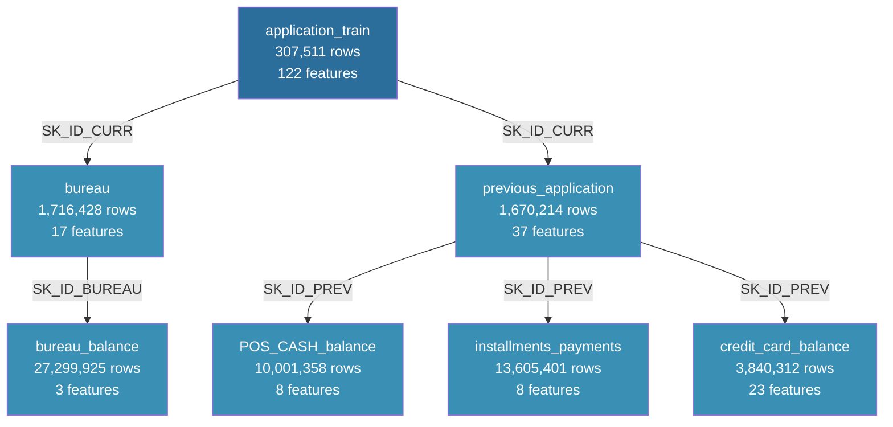

# 🏦 Home Credit Default Risk — Scorecard Model

**Author:** Oknardo Tulung
**Role:** Data Scientist Intern — Home Credit Indonesia
**LinkedIn:** https://www.linkedin.com/in/oknardo-tulung/
**GitHub:** https://github.com/oknardo/Home_Credit_Scorecard_Model

---

## 📌 Project Overview

This project was developed during an internship at **Home Credit Indonesia** as part of a credit risk modeling initiative. The goal is to build a robust credit scorecard model that predicts the probability of loan default for new applicants, enabling Home Credit to make more informed and equitable lending decisions.

Home Credit serves customers who have limited or no credit history, making traditional credit scoring methods insufficient. By leveraging a rich set of behavioral, transactional, and bureau data, this project aims to ensure that creditworthy customers are not rejected, while minimizing default risk exposure.

> *"We want to make sure that clients capable of repayment are not rejected, and that loans are given with a principal, maturity, and repayment calendar that will empower clients to be successful."*

---

## 🎯 Objectives

- Perform comprehensive Exploratory Data Analysis (EDA) across 7 relational datasets
- Build and evaluate 6 machine learning models for default prediction
- Apply hyperparameter tuning to identify the best-performing model
- Generate credit scores and risk tiers for new loan applicants
- Deliver actionable insights for credit risk management

---

## 📂 Dataset Overview

The project uses 7 relational datasets from Home Credit's loan application system:

| Dataset | Rows | Features | Description |
|---|---|---|---|
| `application_train` | 307,511 | 122 | Main table with TARGET variable |
| `bureau` | 1,716,428 | 17 | Previous credits from Credit Bureau |
| `bureau_balance` | 27,299,925 | 3 | Monthly balance of bureau credits |
| `previous_application` | 1,670,214 | 37 | Previous Home Credit applications |
| `POS_CASH_balance` | 10,001,358 | 8 | Monthly POS and cash loan snapshots |
| `installments_payments` | 13,605,401 | 8 | Repayment history of previous credits |
| `credit_card_balance` | 3,840,312 | 23 | Monthly credit card balance snapshots |

### Entity Relationship Diagram

