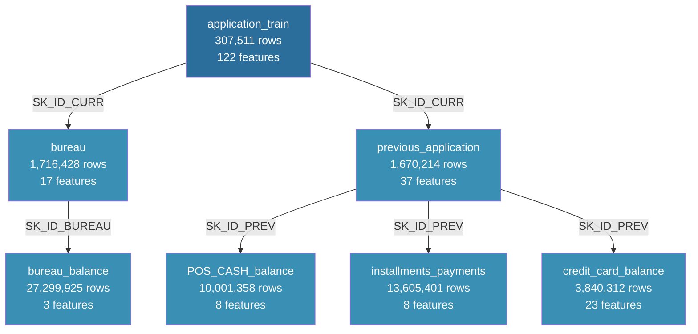

```mermaid
graph TD
    A[application_train\n307,511 rows\n122 features] -->|SK_ID_CURR| B[bureau\n1,716,428 rows\n17 features]
    A -->|SK_ID_CURR| E[previous_application\n1,670,214 rows\n37 features]
    
    B -->|SK_ID_BUREAU| C[bureau_balance\n27,299,925 rows\n3 features]
    
    E -->|SK_ID_PREV| F[POS_CASH_balance\n10,001,358 rows\n8 features]
    E -->|SK_ID_PREV| G[installments_payments\n13,605,401 rows\n8 features]
    E -->|SK_ID_PREV| H[credit_card_balance\n3,840,312 rows\n23 features]

    style A fill:#2C6E9B,color:#fff
    style B fill:#3A8FB5,color:#fff
    style C fill:#3A8FB5,color:#fff
    style E fill:#3A8FB5,color:#fff
    style F fill:#3A8FB5,color:#fff
    style G fill:#3A8FB5,color:#fff
    style H fill:#3A8FB5,color:#fff
```
