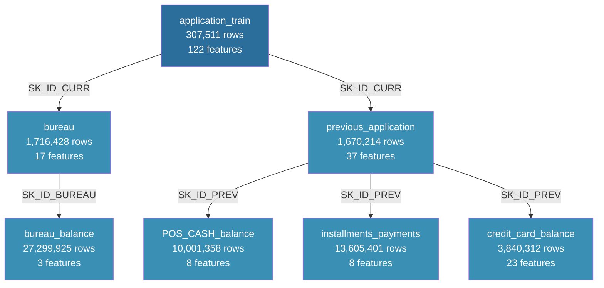

# 🏦 Home Credit Default Risk — Scorecard Model  s

**Author:** Oknardo Tulung  
**Role:** Data Scientist Intern — Home Credit Indonesia  
**LinkedIn:** https://www.linkedin.com/in/oknardo-tulung/  
**GitHub:** https://github.com/oknardo/Home_Credit_Scorecard_Model  

---

## 📌 Project Overview

This project was developed during an internship at **Home Credit Indonesia** as part of a credit risk modeling initiative. The goal is to build a robust credit scorecard model that predicts the probability of loan default for new applicants, enabling Home Credit to make more informed and equitable lending decisions.

Home Credit serves customers who have limited or no credit history, making traditional credit scoring methods insufficient. By leveraging a rich set of behavioral, transactional, and bureau data, this project aims to ensure that creditworthy customers are not rejected, while minimizing default risk exposure.

> *"We want to make sure that clients capable of repayment are not rejected, and that loans are given with a principal, maturity, and repayment calendar that will empower clients to be successful."*

---

## 🎯 Objectives

- Perform comprehensive Exploratory Data Analysis (EDA) across 7 relational datasets
- Build and evaluate 6 machine learning models for default prediction
- Apply hyperparameter tuning to identify the best-performing model
- Generate credit scores and risk tiers for new loan applicants
- Deliver actionable insights for credit risk management

---

## 📂 Dataset Overview

The project uses 7 relational datasets from Home Credit's loan application system:

| Dataset | Rows | Features | Description |
|---|---|---|---|
| `application_train` | 307,511 | 122 | Main table with TARGET variable |
| `bureau` | 1,716,428 | 17 | Previous credits from Credit Bureau |
| `bureau_balance` | 27,299,925 | 3 | Monthly balance of bureau credits |
| `previous_application` | 1,670,214 | 37 | Previous Home Credit applications |
| `POS_CASH_balance` | 10,001,358 | 8 | Monthly POS and cash loan snapshots |
| `installments_payments` | 13,605,401 | 8 | Repayment history of previous credits |
| `credit_card_balance` | 3,840,312 | 23 | Monthly credit card balance snapshots |

### Entity Relationship Diagram



---

## 📓 Notebook Structure

| # | Notebook | Description |
|---|---|---|
| 1 | `EDA_application_train.ipynb` | EDA on main application dataset |
| 2 | `EDA_bureau_and_bureau_balance.ipynb` | EDA on bureau credit history |
| 3 | `EDA_previous_application.ipynb` | EDA on previous Home Credit applications |
| 4 | `EDA_POS_CASH_balance.ipynb` | EDA on POS and cash loan history |
| 5 | `EDA_credit_card_balance.ipynb` | EDA on credit card balance history |
| 6 | `EDA_installments_payments.ipynb` | EDA on installment payment history |
| 7 | `Merged_Dataset.ipynb` | Data aggregation and merging pipeline |
| 8 | `Data Cleaning and Handling.ipynb` | Data cleaning and feature engineering |
| 9 | `Train_Model.ipynb` | Model training, evaluation, and SHAP analysis |
| 10 | `Credit_Scoring.ipynb` | Credit scoring on new applicants |

---

## 📋 Data Pipeline Overview
application_train (307K) + 6 supplementary tables (61M+ rows)  
       ↓  
EDA (7 notebooks) → identify patterns, anomalies, feature signals  
       ↓  
Merged_Dataset.ipynb → aggregate + merge → 265 features  
       ↓  
Data Cleaning and Handling.ipynb → 241 features, 0 missing  
       ↓  
Train_Model.ipynb → 6 models + tuning + SHAP + business simulation  
       ↓  
Credit_Scoring.ipynb → score 48,744 new applicants  
  
--- 
## 🔍 EDA Key Findings

### application_train
- Dataset is heavily **imbalanced** with only **8.1% default rate**, requiring class balancing techniques during modeling
- `EXT_SOURCE_1`, `EXT_SOURCE_2`, `EXT_SOURCE_3` are the **strongest predictors** of default with absolute correlations of 0.16-0.18
- **Younger applicants** show significantly higher default rates (~11%) compared to older applicants (~5%)
- `DAYS_EMPLOYED = 365,243` is an **encoding anomaly** for pensioners/unemployed requiring special handling
- Building features (`_AVG`, `_MODE`, `_MEDI`) are highly redundant — retaining only `_AVG` variants is sufficient

### bureau & bureau_balance
- **85.69%** of applicants have bureau records; 14.31% have no external credit history
- `BUREAU_DAYS_CREDIT_MEAN` is the strongest bureau feature — longer credit history is associated with lower default risk
- `Bad debt` status shows **~20% default rate** despite only 21 records, confirming it as a strong binary risk signal
- `BUREAU_BB_STATUS_MAX` shows clear monotonic relationship with default rate — worst-ever delinquency status is highly predictive

### previous_application
- **Refused applications** show the highest default rate (~12%), confirming prior rejection history as a strong behavioral signal
- `PREV_PROP_REFUSED` and `PREV_REFUSED_COUNT` are the strongest previous application features
- `high` yield group applicants show **~10% default rate** vs `low_action` at ~6% — interest rate tier reflects borrower risk profile
- `AP+ (Cash loan)` channel shows notably higher default rates (~13%) compared to other acquisition channels

### POS_CASH_balance
- **Amortized debt** status shows **~34% default rate** — the strongest categorical risk signal across all supplementary tables
- `Demand` status (~17% default rate) confirms financial distress signal
- `POS_MONTHS_BALANCE_MIN` is the strongest POS feature — longer observable loan history is associated with lower default risk
- DPD features (`SK_DPD`, `SK_DPD_DEF`) show extreme outliers up to 4,231 days requiring capping

### credit_card_balance
- Only **33.68%** of applicants have credit card records — lowest coverage among all supplementary tables
- `CC_UTILIZATION_RATIO` (balance/credit limit) shows the **clearest class separation** among all credit card features
- `CC_AMT_BALANCE_MEAN` and `CC_CNT_DRAWINGS_CURRENT_MEAN` rank in the **top 10 features overall** despite low coverage
- `Demand` status shows **~20% default rate**, consistent with POS_CASH_balance findings

### installments_payments
- **8.43% late payment rate** closely mirrors the overall default rate (8.07%), confirming payment discipline as a key signal
- `INST_PROP_LATE` and `INST_PROP_UNDERPAID` show the **clearest class separation** among installment features
- `INST_AMT_PAYMENT_RATIO` (total paid / total scheduled) confirms that consistent full repayment is strongly associated with lower default risk
- Chronic late payments (`INST_LATE_COUNT` > 70) show default rates approaching **60%**

---

## ⚙️ Feature Engineering

Key derived features created from domain knowledge:

| Feature | Formula | Insight |
|---|---|---|
| `CREDIT_TO_INCOME_RATIO` | AMT_CREDIT / AMT_INCOME_TOTAL | Debt burden relative to income |
| `ANNUITY_TO_INCOME_RATIO` | AMT_ANNUITY / AMT_INCOME_TOTAL | Monthly payment burden |
| `CREDIT_TO_ANNUITY_RATIO` | AMT_CREDIT / AMT_ANNUITY | Proxy for loan term length |
| `AGE_YEARS` | DAYS_BIRTH / -365 | Applicant age in years |
| `EMPLOYED_TO_AGE_RATIO` | EMPLOYED_YEARS / AGE_YEARS | Employment stability |
| `EXT_SOURCE_MEAN` | Mean of EXT_SOURCE_1/2/3 | Combined external credit score |
| `EXT_SOURCE_PROD` | Product of EXT_SOURCE_1/2/3 | Joint low-score effect |
| `BUREAU_INST_DELINQUENCY` | BUREAU_BB_PROP_DELINQUENT + INST_PROP_LATE | Cross-table delinquency signal |

---

## 🤖 Modeling Results

### Model Comparison

| Model | ROC-AUC | Gini | KS Stat | Recall (Default) | Precision (Default) |
|---|---|---|---|---|---|
| Logistic Regression | 0.6643 | 0.3286 | 0.2502 | 0.5704 | 0.1327 |
| Decision Tree | 0.6727 | 0.3454 | 0.2828 | 0.3065 | 0.1547 |
| Random Forest | 0.7112 | 0.4224 | 0.3228 | 0.1505 | 0.2092 |
| LightGBM | 0.7802 | 0.5603 | 0.4256 | 0.0475 | 0.4866 |
| XGBoost | 0.7794 | 0.5587 | 0.4204 | 0.0510 | 0.5050 |
| CatBoost | 0.7761 | 0.5522 | 0.4211 | 0.0421 | 0.5359 |
| **LightGBM Tuned** | **0.7820** | **0.5640** | **0.4269** | 0.0532 | 0.4807 |

**LightGBM Tuned** achieves the best overall performance with ROC-AUC of **0.7820**, Gini of **0.5640**, and KS Statistic of **0.4269**.

### Top Features (SHAP Analysis — LightGBM Tuned)

| Rank | Feature | Source | Direction |
|---|---|---|---|
| 1 | `EXT_SOURCE_MEAN` | application_train | Higher = Lower Risk |
| 2 | `PREV_YIELD_HIGH_COUNT` | previous_application | Higher = Lower Risk |
| 3 | `OBS_30_CNT_SOCIAL_CIRCLE` | application_train | Higher = Lower Risk |
| 4 | `FLAG_OWN_CAR` | application_train | Car Owner = Higher Risk |
| 5 | `OWN_CAR_AGE` | application_train | Older Car = Higher Risk |
| 6 | `EXT_SOURCE_MIN` | application_train | Higher = Lower Risk |
| 7 | `INST_HAS_LATE` | installments_payments | Has Late = Higher Risk |
| 8 | `FLAG_EMP_PHONE` | application_train | No Phone = Higher Risk |
| 9 | `INST_AMT_PAYMENT_DIFF_MAX` | installments_payments | Higher Diff = Higher Risk |
| 10 | `BUREAU_INST_DELINQUENCY` | bureau + installments | Higher = Higher Risk |

---

## 📊 Credit Scoring Results

Applied to **48,744 new applicants** from `application_test.csv`:

| Risk Tier | Count | Percentage | Avg Probability |
|---|---|---|---|
| Low Risk (< 0.10) | 32,157 | 65.97% | 0.0441 |
| Medium Risk (0.10 - 0.30) | 13,553 | 27.80% | 0.1698 |
| High Risk (0.30 - 0.50) | 2,546 | 5.22% | 0.3762 |
| Very High Risk (> 0.50) | 488 | 1.00% | 0.5772 |

---

## 💰 Business Simulation

Using LightGBM Tuned, a business impact simulation was conducted to quantify the financial benefit of model deployment across multiple classification thresholds.

**Baseline (No Model):**
- Total defaulters: 24,825 (8.07% default rate)
- Average credit per defaulter: IDR 556,579
- Loss Given Default (LGD): 60%
- **Total estimated portfolio loss: IDR 8.29 Miliar**

**Threshold Simulation Results:**

| Threshold | Recall | Precision | Defaults Prevented | Remaining Defaults | Loss Prevented | Opportunity Cost | Net Benefit |
|---|---|---|---|---|---|---|---|
| 0.50 | 5.32% | 48.09% | 1,320 | 23,505 | IDR 441 Juta | IDR 855 Juta | -IDR 414 Juta |
| 0.40 | 11.20% | 43.61% | 2,780 | 22,045 | IDR 928 Juta | IDR 2.16 Miliar | -IDR 1.23 Miliar |
| 0.35 | 15.35% | 40.15% | 3,810 | 21,015 | IDR 1.27 Miliar | IDR 3.41 Miliar | -IDR 2.13 Miliar |
| 0.30 | 21.01% | 37.33% | 5,215 | 19,610 | IDR 1.74 Miliar | IDR 5.25 Miliar | -IDR 3.51 Miliar |
| 0.25 | 27.81% | 33.58% | 6,905 | 17,920 | IDR 2.31 Miliar | IDR 8.19 Miliar | -IDR 5.88 Miliar |
| 0.20 | 36.98% | 28.99% | 9,180 | 15,645 | IDR 3.07 Miliar | IDR 13.49 Miliar | -IDR 10.42 Miliar |

**Key Insights:**

**Threshold 0.5 is the Most Cost-Efficient**
At the recommended threshold of 0.5, the model identifies and prevents approval of **1,320 high-risk applicants** out of 24,825 total defaulters, reducing estimated portfolio losses by **IDR 441 Juta**. This threshold achieves the highest precision (48.09%) and the most favorable loss-prevented to opportunity-cost ratio among all thresholds tested.

**23,505 Defaulters Remain Undetected**
At threshold 0.5, **23,505 defaulters still pass through** undetected, representing a remaining estimated loss of **IDR 7.85 Miliar**. This reflects the fundamental precision-recall trade-off of gradient boosting models on heavily imbalanced datasets.

**Opportunity Cost Dominates at All Thresholds**
Across all tested thresholds, opportunity cost from incorrectly rejecting good applicants consistently exceeds loss prevented, resulting in negative net benefit at every threshold. At threshold 0.5, for every 1 defaulter correctly identified, approximately 1.08 good applicants are wrongly rejected. This ratio worsens to 2.45 at threshold 0.2.

**Segmented Business Impact**
The risk tier segmentation from `Credit_Scoring.ipynb` provides a more actionable deployment view:

| Risk Tier | Applicants | % | Recommended Action |
|---|---|---|---|
| Low Risk (< 0.10) | 32,157 | 65.97% | Approve with standard terms |
| Medium Risk (0.10-0.30) | 13,553 | 27.80% | Approve with enhanced monitoring |
| High Risk (0.30-0.50) | 2,546 | 5.22% | Stricter evaluation or reduced principal |
| Very High Risk (> 0.50) | 488 | 1.00% | Reject or require additional collateral |

The **Very High Risk segment alone (488 applicants, 1%)** represents an estimated **IDR 163 Juta** in preventable losses (488 × IDR 556,579 × 60% LGD), making targeted rejection of this segment the most immediately actionable business recommendation.

**Path to Positive Net Benefit**
To achieve positive net benefit from model deployment, one or more of the following improvements is required:
- **Precision above 50%** through further feature engineering, ensemble stacking, or cost-sensitive learning
- **Cost-weighted threshold optimization** using actual business cost ratio of default loss vs rejected loan opportunity cost
- **Segmented deployment** where the model is applied selectively to High Risk and Very High Risk segments, reducing opportunity cost while preserving most of the loss prevention benefit


## 🛠 Tech Stack

- **Language**: Python 3.14
- **Data Processing**: Pandas, NumPy
- **Visualization**: Matplotlib, Seaborn
- **Machine Learning**: Scikit-learn, LightGBM, XGBoost, CatBoost
- **Hyperparameter Tuning**: Optuna
- **Interpretability**: SHAP
- **Class Imbalance**: Imbalanced-learn (SMOTE)
- **Model Persistence**: Joblib

---

## 📁 Project Structure  
Home_Credit_Scorecard_Model  
├── EDA_application_train.ipynb  
├── EDA_bureau_and_bureau_balance.ipynb  
├── EDA_previous_application.ipynb  
├── EDA_POS_CASH_balance.ipynb  
├── EDA_credit_card_balance.ipynb  
├── EDA_installments_payments.ipynb  
├── Merged_Dataset.ipynb  
├── Data Cleaning and Handling.ipynb  
├── Train_Model.ipynb  
├── Credit_Scoring.ipynb  
└── README.md  

---

## 🚀 How to Run

1. Clone the repository
```bash
git clone https://github.com/oknardo/Home_Credit_Scorecard_Model.git
```

2. Install dependencies
```bash
pip install -r requirements.txt
```

3. Run notebooks in order:
EDA notebooks (1-7) → Merged_Dataset → Data Cleaning and Handling → Train_Model → Credit_Scoring

---

## 📄 License

This project is developed for internship and portfolio purposes at Home Credit Indonesia.